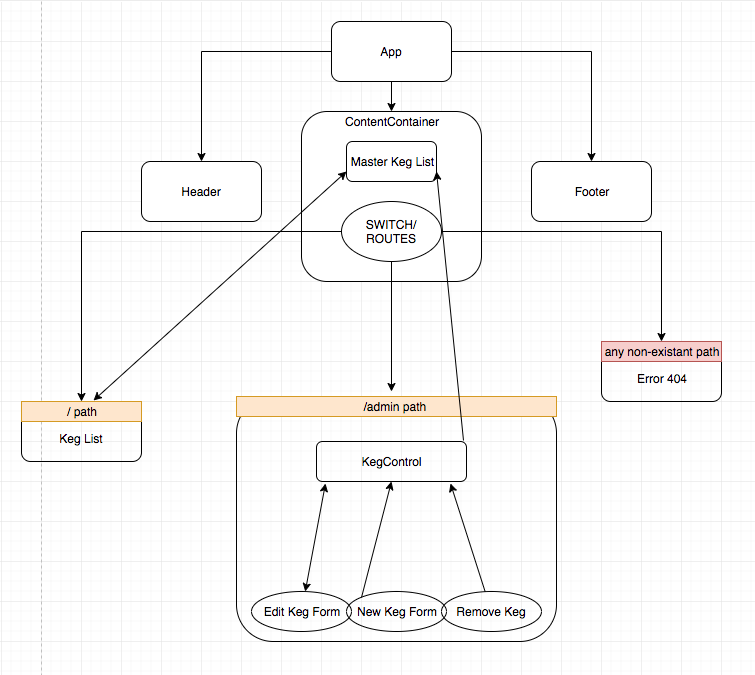

## Taproom/Pub Menu React App
#### _React practice, homework as assigned by Epicodus, 3/27/19_

#### Slater Smith

### Description

Application built for React routing and state management practice using example persona stories from Epicodus homework assignment. The application is meant to provide potential bar/pub employees with a tool for entering and editing information about the beers it carries on tap.

#### Program behavior specifications:
| Behavior | Input | Output |
| --------------------------- | ------------------- | ------------------- |
| If a user submits information into form in admin view, a new keg with inputed specs will appear in the list window| User navigates to 'admin' in top menu and enters new beer name, brand, price, and alcohol percentage into respective form inputs and clicks 'submit' | New keg information appears next to default data when user navigates to 'list' view |

### Technologies and Resources

* React
* npm & Node

### Component Tree

### Setup Instructions

1. Clone this repository to your desktop at https://github.com/SlaterJamesSmith/react-taproom-app
2. Use a terminal of your choice to access the webpage and its files by inputting: "git clone {the above clone link}"
3. If homebrew is not yet installed on your Mac, install it by running the following command in your terminal: "$ /usr/bin/ruby -e "$(curl -fsSL https://raw.githubusercontent.com/Homebrew/install/master/install)"
4. If you are not using a Mac, and homebrew is not yet installed, go to the node website and follow appropriate installer for your operating system at https://nodejs.org/en/download/
5. Navigate into your new directory and run '$ npm i' and then 'npm run start'
6. In your preferred web browser, got to url 'localhost:8080'

### Roadmap / Future Behavior Specifications:

| Behavior | Input | Output |
| --------------------------- | ------------------- | ------------------- |
| User can edit existing information for any existing keg| User clicks 'Edit' button next to any taplist item in the admin view | New form appears at the bottom of the page |
| Edited keg information is saved by the browser | After clicking 'Edit' the user enters new information in the new form inputs and clicks 'Done'| New inputted content is saved to its respective list item in the 'list' view |
| User can remove any keg | User clicks 'Remove Keg' next to any desired keg in the admin view| Keg is removed from list view |

**Notes:**
- Had trouble successfully showing 'KegList' component simultaneously in 'list' view and 'admin' view because of data flow issues.

### License

*This software is licensed under the MIT license*
Copyright (c) 2019 **_Slater Smith_**
