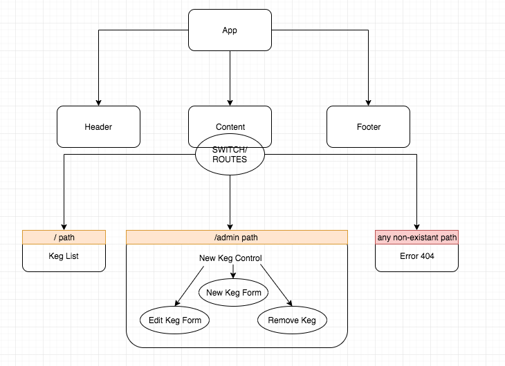

## Taproom/Pub Menu App
#### _Angular practice, homework as assigned by Epicodus, 3/27/19_

#### Slater Smith

### Description

Application built for Angular practice using example persona stories from Epicodus homework assignment. The application is meant to provide potential bar/pub employees with a tool for entering and editing information about the beers it carries on tap.

#### Program behavior specifications:
| Behavior | Input | Output |
| --------------------------- | ------------------- | ------------------- |
| If a user submits information into form, a new keg with inputed specs will appear| User enters new beet name, brand, price, and alcohol percentage into respective form inputs and clicks 'submit' | New keg information appears below default list |
| User can edit existing information for any existing keg| User clicks 'Edit' button below list starting with 'keg2' | New form appears at the bottom of the page |
| Edited keg information is saved in by the browser | After clicking 'Edit' the user enters new information in the new form inputs and clicks 'Done'| New inputted content is saved to its respective list item |

### Technologies and Resources

* Angular
* npm & Node

### Component Tree

### License

*This software is licensed under the MIT license*
Copyright (c) 2019 **_Slater Smith_**

**Notes:**
- So far, I'm able to store data across components, but can't yet get it to render when updated. 1:20pm 4/19/19
- Working on states, but can't get ReactDOM to work 2:37pm 4/19/19
- Trying to pass data to grandchild component, but unsure whether I need to refactor child component function into a class to do so 4:06pm 4/19/19
